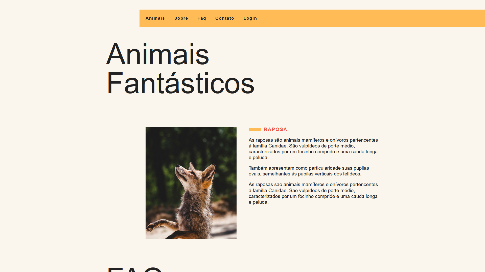

<h1 align="center"> Animais Fantásticos </h1>

  

  <a href="#-tecnologias" style="color: #517ac8;">Tecnologias 💻</a>&nbsp;&nbsp;&nbsp;|&nbsp;&nbsp;&nbsp;</a>
  <a href="#-projeto" style="color: #517ac8;">Projeto 🪶</a>&nbsp;&nbsp;&nbsp;|&nbsp;&nbsp;&nbsp;</a>
  <a href="#memo-licença" style="color: #517ac8;">Licença 📕</a>

 

  

## 💻 Tecnologias

Esse projeto foi desenvolvido com as seguintes tecnologias:

- HTML, CSS & JavaScript
- Git & Github

## 🪶 Projeto

Projeto realizado para aperfeiçoar habilidades com JavaScript puro.

- <a href="https://raphetes.github.io/animals/" style="color: #517ac8" target="_blank">Acesse o projeto</a>

---
## 📕 Licença

Feito por Raphael Melo.
